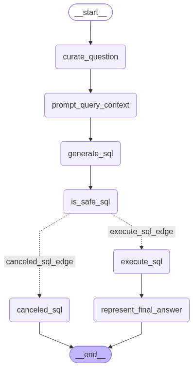

# SQL AI Agent

An automated workflow designed to safely convert natural language questions into SQL queries, validate them for execution safety, run queries, and format analytical responses.

## Workflow Architecture

  

## Execution Steps

1. **`curate_question`**: Receives and processes the initial query input.
2. **`prompt_query_context`**: Prepares the relevant database context and prompt structures.
3. **`generate_sql`**: Translates the contextual prompt into a candidate SQL query.
4. **`is_safe_sql`**: Validates query safety and routes down one of two conditional edges:
   - **`canceled_sql_edge`** $\rightarrow$ **`canceled_sql`**: Safely terminates queries that fail security check.
   - **`execute_sql_edge`** $\rightarrow$ **`execute_sql`**: Runs validated queries against the database and forwards the output to **`represent_final_answer`**.
